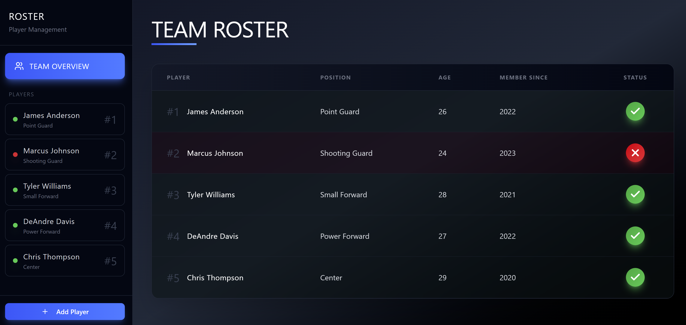
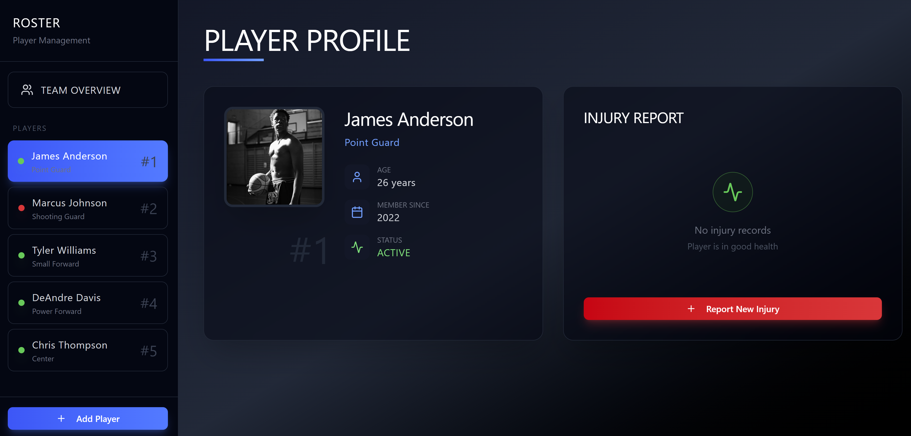
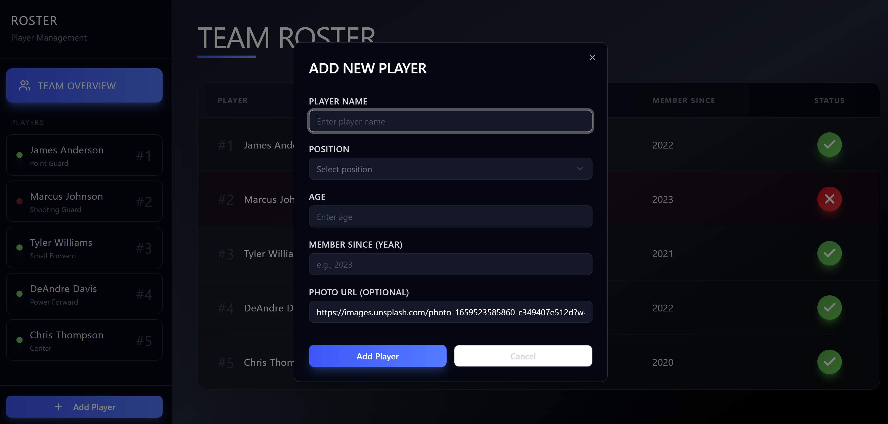
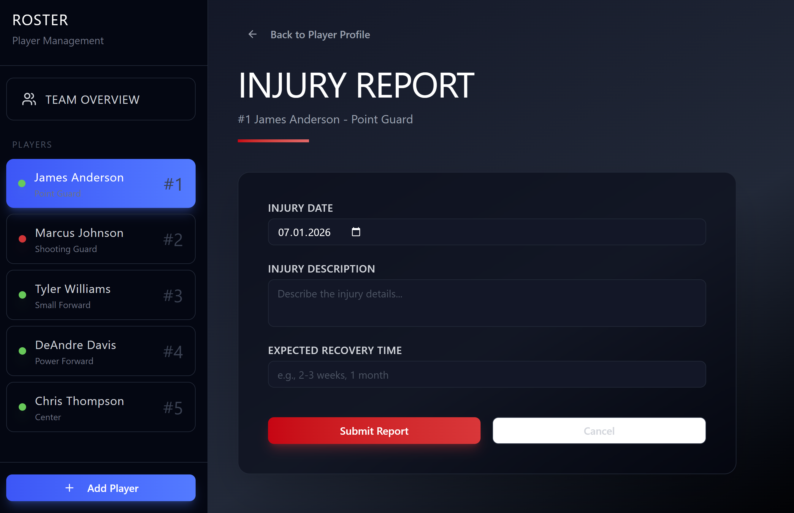
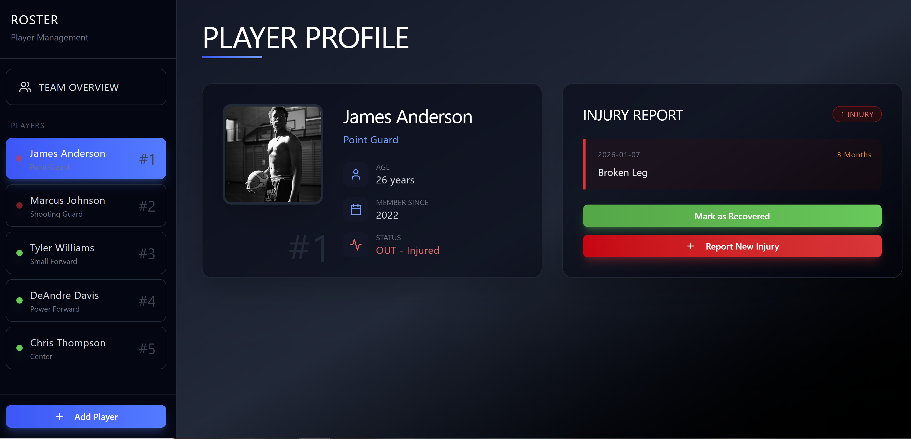
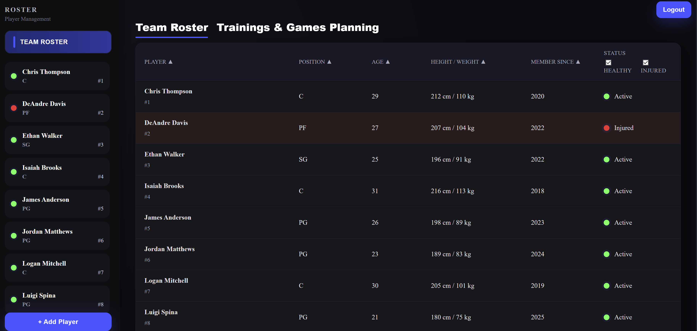
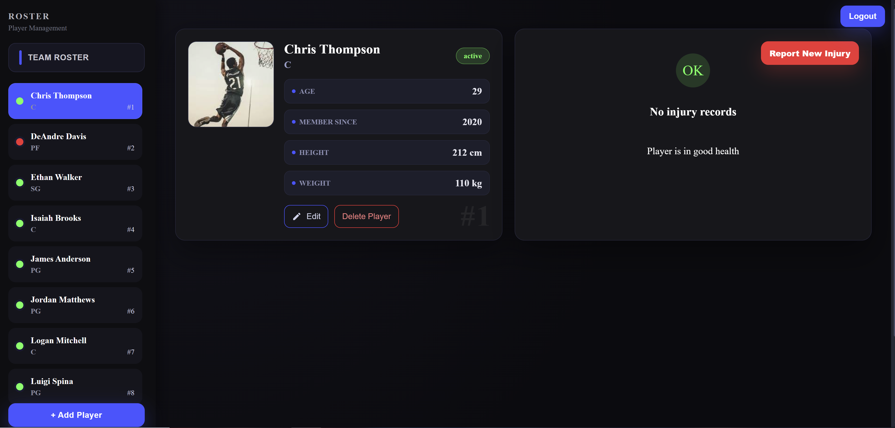
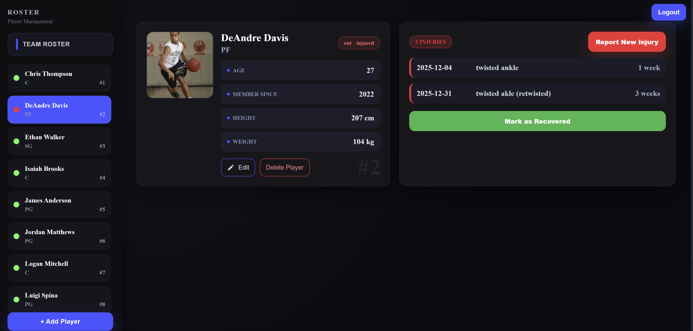
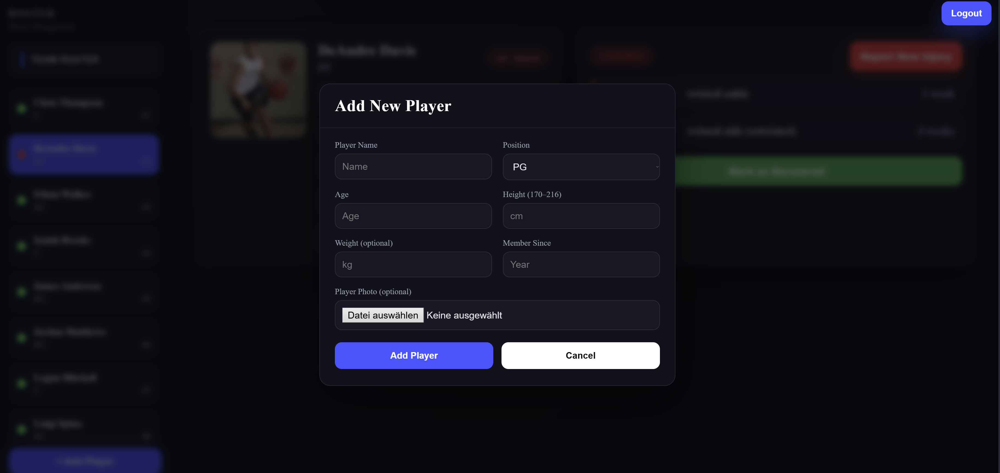

# Projektdokumentation – Prototyping: PlayerManagementTool

## Inhaltsverzeichnis

1. [Einordnung & Zielsetzung](#1-einordnung--zielsetzung)
2. [Zielgruppe & Stakeholder](#2-zielgruppe--stakeholder)
3. [Anforderungen & Umfang](#3-anforderungen--umfang)
4. [Vorgehen & Artefakte](#4-vorgehen--artefakte)
    - [Understand & Define](#41-understand--define)
    - [Sketch](#42-sketch)
    - [Decide](#43-decide)
    - [Prototype](#44-prototype)
    - [Validate](#45-validate)
5. [Erweiterungen [Optional]](#5-erweiterungen-optional)
6. [Projektorganisation [Optional]](#6-projektorganisation-optional)
7. [KI‑Deklaration](#7-ki‑deklaration)
8. [Anhang [Optional]](#8-anhang-optional)

> **Hinweis:** Massgeblich sind die im **Unterricht** und auf **Moodle** kommunizierten Anforderungen.

<!-- WICHTIG: DIE KAPITELSTRUKTUR DARF NICHT VERÄNDERT WERDEN! -->

<!-- Diese Vorlage ist für eine README.md im Repository gedacht. Abschnitte mit [Optional] können weggelassen werden, wenn in den Übungen nichts anderes verlangt wird. -->

## 1. Einordnung & Zielsetzung
Kurz beschreiben, welches Problem adressiert wird und welches Ergebnis angestrebt ist.
- **Kontext & Problem:** 

  Trainer kleiner Sportteams haben häufig keinen strukturierten Überblick über ihre Spieler, deren Verfügbarkeit und mögliche Aufstellungen. Informationen darüber, wer für das nächste Spiel einsatzbereit ist, müssen oft manuell oder über persönliche Rückfragen eingeholt werden. Dadurch entsteht schnell Chaos, besonders wenn Verletzungen auftreten und sich die Verfügbarkeit kurzfristig ändert.

- **Ziele:** 

  Das Tool soll eine einfache und zentrale Möglichkeit bieten, Spieler anzulegen, zu verwalten und ihre aktuelle Einsatzfähigkeit festzuhalten. Trainer sollen jederzeit sehen können, welche Spieler verfügbar oder verletzt sind und auf dieser Basis potenzielle Aufstellungen planen können. Kernfunktionen sind das Erfassen, Bearbeiten und Löschen von Spielern sowie das Dokumentieren von Verletzungen oder Ausfällen.

- **Abgrenzung:** 

  Nicht Bestandteil des Projekts sind Taktikvisualisierungen, Statistiken oder Live-Tracking der Spieler während der Verletzung. Das Tool konzentriert sich bewusst auf die Kernverwaltung der Spielerverfügbarkeit ohne zusätzliche Analyse- oder Monitoring-Funktionen.

## 2. Zielgruppe & Stakeholder
Wem nützt die Lösung, wer ist beteiligt oder betroffen?
- **Primäre Zielgruppe:** 

  Die Hauptzielgruppe sind Club-Manager und Coaches kleiner Sportteams, die einen klaren Überblick über ihren Spielerkader benötigen. Sie verwalten den Roster, treffen Entscheidungen für Spiele und müssen wissen, welche Spieler aktuell verfügbar, verletzt oder eingeschränkt einsatzbereit sind. Dabei betrifft es den Coach mehr, weil er viel näher an den Spielern dran ist.

- **Weitere Stakeholder:** 
 
  - **Assistant Coaches:** 
    profitieren von einem übersichtlichen Zugriff auf alle Spielerinformationen, um Trainings und Spiele besser planen zu können.  
  - **Spieler:** auch wenn sie das Tool nicht aktiv bedienen, betrifft sie die Verwaltung ihrer Verfügbarkeit und Verletzungen direkt, insbesondere im Hinblick auf Kommunikation, Wiedereinstiegszeit und Belastungsmanagement.
- **Annahmen:** 
  - Die Trainer und Manager haben wenig Zeit und benötigen ein einfaches, schnelles Tool, um Übersicht über Verfügbarkeiten, Verletzungen und den Kaderstatus zu behalten.  
  - Die Verfügbarkeit der Spieler ist oft unklar oder wird spät kommuniziert, weshalb eine zentrale Dokumentation entscheidend ist.  
  - Wiederkehrende Verletzungen und mentale Belastungen sind reale Herausforderungen im Teamalltag, werden aber im Rahmen dieses Tools nicht tiefgehend behandelt, der Fokus liegt rein auf der Verfügbarkeitsverwaltung. 

## 3. Anforderungen & Umfang

- **Kernfunktionalität (Mindestumfang):** 

  Die Kernfunktionalität des PlayerManagementTools orientiert sich am in den Übungen ab Semesterwoche 8 definierten Mindestumfang. Ziel ist es, die grundlegenden Workflows zur Verwaltung eines Spielerkaders abzudecken und die Einsatzfähigkeit der Spieler übersichtlich darzustellen.

  Nutzende können Spieler anlegen, bestehende Spielerdaten bearbeiten sowie Spieler aus dem Kader entfernen. Zu jedem Spieler können relevante Basisinformationen wie Name, Position und Alter erfasst werden.

  Ein zentraler Bestandteil des Tools ist die Verwaltung von Verletzungen. Tritt eine Verletzung auf, kann diese einem Spieler hinzugefügt werden, wodurch sich dessen Verfügbarkeitsstatus entsprechend ändert. Der aktuelle Status eines Spielers (einsatzbereit oder verletzt) ist jederzeit ersichtlich und bildet die Grundlage für Planungs- und Entscheidungsprozesse des Trainers.

  Die Kernworkflows sind so gestaltet, dass sie ohne zusätzliche Erklärungen verständlich sind und den Nutzenden eine schnelle Orientierung über den Zustand des Teams ermöglichen.

- **Akzeptanzkriterien:** 

  Die Erfüllung der Kernfunktionalität wird anhand folgender Akzeptanzkriterien überprüft:

  "Nutzende können einen neuen Spieler erfolgreich anlegen und dieser erscheint unmittelbar in der Teamübersicht."

  "Bestehende Spielerdaten können bearbeitet und gespeichert werden, ohne dass Daten verloren gehen."

  "Spieler können aus dem Kader gelöscht werden und sind danach nicht mehr sichtbar."

  "Verletzungen können einem Spieler hinzugefügt werden und führen zu einer klaren Statusänderung."

  "Der aktuelle Status eines Spielers ist jederzeit eindeutig erkennbar."

  "Zentrale Workflows können von Anfang bis Ende ohne Fehlermeldungen durchgeführt werden."

  Diese Kriterien stellen sicher, dass der Prototyp den vorgesehenen Mindestumfang vollständig und stabil abdeckt.

- **Erweiterungen:** 

  Neben der beschriebenen Kernfunktionalität wurden optionale Erweiterungen umgesetzt, die über den in den Übungen definierten Mindestumfang hinausgehen. Diese Erweiterungen sind nicht Bestandteil der grundlegenden Anforderungen und werden daher separat in Kapitel 5 dokumentiert und begründet.

## 4. Vorgehen & Artefakte

### 4.1 Understand & Define
- **Ausgangslage & Ziele:**  
Zu Projektbeginn bestand die Ausgangslage darin, dass Trainer und Verantwortliche kleiner Sportteams ihre Spielerverfügbarkeit häufig ohne zentrale, strukturierte Unterstützung verwalten. Informationen zu Verletzungen, Einsatzfähigkeit und Kaderstatus sind oftmals fragmentiert oder nur informell verfügbar, was die Planung von Trainings und Spielen erschwert. 
Ziel dieser Phase war es, den Problemraum klar zu verstehen, die relevanten Nutzergruppen zu identifizieren und deren Bedürfnisse zu analysieren. Auf dieser Basis sollten die zentralen Anforderungen an den Prototypen definiert werden, um eine fundierte Grundlage für die anschliessende Konzeption und Umsetzung zu schaffen.

- **Zielgruppenverständnis:** 
 
  Zur Erarbeitung eines fundierten Zielgruppenverständnisses wurden zentrale Nutzergruppen identifiziert und in Form von Proto-Personas konkretisiert. Der Fokus liegt auf Coaches kleiner Sportteams, die als primäre Nutzende für die operative Planung von Trainings und Spielen verantwortlich sind und einen schnellen Überblick über den aktuellen Kaderstatus benötigen.Ergänzend wurde die Perspektive eines Clubpräsidenten als sekundärer Stakeholder berücksichtigt, dessen Interesse vor allem in der strukturierten und verlässlichen Verwaltung von Spielerinformationen liegt. Die Analyse dieser Rollen bildete die Grundlage für die Priorisierung der Anforderungen und die konsequente Ausrichtung des Prototyps auf die Bedürfnisse der primären Zielgruppe.

Folgende **Problemraumanalyse** wurde erarbeitet:
| Nutzergruppe | Bedürfnisse | Kontext / Herausforderungen | How Might We |
|--------------|------------|-----------------------------|--------------|
| Club-Manager | Überblick über den eigenen Kader und organisatorische Sicherheit | Entscheidungen zur Teamzusammenstellung sind schwierig, da es keine zentrale Übersicht über Spielerstatus und Verfügbarkeit gibt | Wie könnten wir das Rostermanagement vereinfachen, um fundierte Entscheidungen trotz Verletzungen treffen zu können? |
| Coaches / Assistant Coaches | Planungssicherheit für Trainings und Spiele; individueller Umgang mit Spielern | Es ist oft unklar, welche Spieler aktuell einsatzbereit sind, insbesondere bei kurzfristigen Verletzungen | Wie könnten wir die Verfügbarkeit der Spieler transparent und schnell erfassbar machen? |
| Spieler | Gesund bleiben und möglichst schnell wieder einsatzfähig sein | Verletzungen sind mental belastend und erschweren die Rückkehr in den Spielbetrieb | Wie könnten wir Spieler indirekt besser im Umgang mit Verletzungen unterstützen? |

Zur weiteren Konkretisierung der identifizierten Zielgruppen wurden **Proto-Personas** erstellt. Diese repräsentieren typische Vertreter der relevanten Nutzerrollen und dienen als Referenz für Design- und Entscheidungsprozesse im weiteren Projektverlauf.

| Kategorie | Beschreibung |
|----------|--------------|
| Name | Oliver Bäcker |
| Rolle | Coach |
| Alter | 40 Jahre |
| Hintergrund | Ehemaliger Profi-Basketballspieler mit 10-jähriger Karriere |
| Eigenschaften | Instruktiv, erfahrungsbasiert, entscheidungsfreudig |
| Ziele | Schneller Überblick über die Verfügbarkeit der Spieler |
| Aufgaben | Planung von Trainings, Organisation des Spielbetriebs, Erstellung von Spielzügen |
| Bedürfnisse | Klare, zentrale Übersicht über Spielerstatus und Verletzungen |
| Frustpunkte | Keine zentrale Ablage von Spielerinformationen; hoher Planungsaufwand bei kurzfristigen Ausfällen |

| Kategorie | Beschreibung |
|----------|--------------|
| Name | Jan Heimer |
| Rolle | Präsident des Clubs |
| Alter | 42 Jahre |
| Hintergrund | Ehemaliger Profi-Basketballspieler mit 8-jähriger Karriere |
| Eigenschaften | Strategisch denkend, langfristig orientiert |
| Ziele | Überblick über den Kader und organisatorische Stabilität |
| Aufgaben | Strategische Führung des Clubs, Ressourcenplanung |
| Bedürfnisse | Verlässliche und strukturierte Spielerinformationen |
| Frustpunkte | Fehlende Transparenz über den aktuellen Kaderstatus |

Der Coach stellt die primäre Persona des Projekts dar, da er das Tool im operativen Alltag aktiv nutzt und unmittelbar von einer klaren Übersicht über Spielerstatus und Verfügbarkeit abhängig ist. Entsprechend wurden die zentralen Workflows und Interaktionen des Prototyps konsequent auf seine Bedürfnisse ausgerichtet.

Der Clubpräsident wurde als sekundäre Persona berücksichtigt. Seine Perspektive dient vor allem dazu, organisatorische und strategische Anforderungen zu verstehen, steht jedoch nicht im Fokus der Interaktion mit dem Prototypen. Obwohl der Clubpräsident nicht zur primären Nutzergruppe gehört, hat er als wichtiger Stakeholder einen grossen Einfluss auf die Umsetzung des Projekts.

- **Wesentliche Erkenntnisse:** 
  - Es besteht ein hoher Bedarf an einer zentralen und übersichtlichen Verwaltung von Spielerinformationen.
  - Verletzungen und deren Auswirkungen auf die Einsatzfähigkeit sind ein kritischer Faktor im Teamalltag.
  - Trainer benötigen schnelle, eindeutige Informationen, um unter Zeitdruck Entscheidungen treffen zu können.
  - Komplexe Systeme oder umfangreiche Zusatzfunktionen würden die Nutzung eher erschweren als verbessern.
  - Der Fokus sollte auf Klarheit, Einfachheit und Aktualität der Informationen liegen.

### 4.2 Sketch
- **Variantenüberblick:** 

  In einer frühen Phase wurden mehrere Varianten für die Darstellung der Spielerkarte skizziert, um unterschiedliche Ansätze hinsichtlich Übersichtlichkeit und Informationsdarstellung zu vergleichen. Der Fokus lag dabei insbesondere auf der Frage, wie Verletzungen und deren Verlauf sinnvoll dargestellt werden können.

- **Skizzen:** 

  Variante 1 erwies sich als zu wenig intuitiv, da der Verletzungsstatus lediglich als einfacher Status (Boolean) angezeigt wurde und der detaillierte Verlauf über eine separate Seite erreichbar war. Diese Trennung erschwerte den schnellen Zugriff auf relevante Informationen.

  Variante 2 wurde insgesamt als deutlich übersichtlicher bewertet, da die Verletzungshistorie direkt auf der Spielerkarte sichtbar ist. Dadurch können Verletzungen schneller erfasst und besser nachvollzogen werden, ohne den Kontext zu wechseln. Diese Variante bildete die Grundlage für die spätere Umsetzung der Spielerkarte.

  Variante 3 stellt keine direkte Alternative zur Spielerkarte dar, sondern zeigt eine Teamübersicht, in der alle Spieler gemeinsam dargestellt werden. Sie ermöglicht es, den Verletzungsstatus einzelner Spieler auf einen Blick zu erkennen und diente als Grundlage für einen separaten Übersichts-Screen.

  

### 4.3 Decide
- **Gewählte Variante & Begründung:** 

  Auf Basis der Variantenanalyse wurde eine kombinierte Lösung entwickelt, bei der die Teamübersicht als zentraler Einstiegspunkt dient. Dieser Screen zeigt alle Spieler des Teams und ermöglicht einen schnellen Überblick über deren Status.

  Ergänzend wurde auf der linken Seite eine Navigation integriert, die als Spielernavigation fungiert und einen direkten Wechsel zwischen einzelnen Spielerprofilen erlaubt.

  Die Spielerkarte orientiert sich in Aufbau und Inhalt an der zuvor ausgewählten Variante 2 und stellt neben den Basisinformationen auch die Verletzungshistorie prominent dar. Zusätzlich wurde ein separater Screen zum Erfassen neuer Verletzungen skizziert, um diesen Workflow klar vom restlichen Profil zu trennen und gezielt zu unterstützen.

  

  Ergänzend zur Teamübersicht und Spielerkarte wurde ein separater Screen zum Hinzufügen neuer Spieler skizziert. Dieser ermöglicht die Erfassung der grundlegenden Spielerinformationen und ergänzt die zentralen Verwaltungsfunktionen des Tools.

  Funktionen zur Bearbeitung bestehender Spielerdaten sind im Prototyp ebenfalls vorgesehen und umgesetzt, auch wenn sie in den Skizzen nicht explizit dargestellt sind. Der Fokus der Skizzen lag bewusst auf den Kern-Workflows "Spieler hinzufügen" und "Verletzung erfassen".

  

- **End‑to‑End‑Ablauf:** 

  Der End-to-End-Ablauf des PlayerManagementTools orientiert sich konsequent an den zentralen Aufgaben eines Coaches im Teamalltag und bildet die vollständige Verwaltung eines Spielerkaders von der Übersicht bis zur Detailbearbeitung ab.

  Der Einstieg in das Tool erfolgt über die Teamübersicht, welche als zentraler Hauptscreen dient. Hier werden alle Spieler des Teams gemeinsam dargestellt, sodass der aktuelle Kaderstatus auf einen Blick ersichtlich ist. Insbesondere der Verletzungsstatus einzelner Spieler kann direkt erkannt werden, was eine schnelle Einschätzung der Teamverfügbarkeit ermöglicht.

  Über eine seitliche Navigation kann gezielt zwischen einzelnen Spielern gewechselt werden. Die Auswahl eines Spielers führt zur entsprechenden Spielerkarte, auf der die relevanten Detailinformationen dargestellt sind. Neben den grundlegenden Spielerinformationen wird insbesondere die Verletzungshistorie prominent angezeigt, um den Gesundheitszustand und vergangene Ausfälle nachvollziehbar zu machen.

  Tritt eine neue Verletzung auf, kann diese über einen klar abgegrenzten Workflow erfasst werden. Dazu steht ein separater Screen zur Verfügung, der sich auf die Eingabe der verletzungsrelevanten Informationen konzentriert und den Kontext der Spielerkarte bewusst nicht überlädt. Nach dem Erfassen einer Verletzung wird der Status des Spielers entsprechend aktualisiert.

  Ergänzend ermöglicht das Tool das Hinzufügen neuer Spieler über einen eigenen Screen. Dadurch kann der Kader laufend gepflegt und erweitert werden. Funktionen zur Bearbeitung bestehender Spielerdaten sind integraler Bestandteil des Prototyps und ergänzen die Kernworkflows, auch wenn sie in den Skizzen nicht explizit dargestellt sind.

  Der gesamte Ablauf ist so konzipiert, dass häufige Aufgaben ohne unnötige Zwischenschritte durchgeführt werden können und alle relevanten Informationen jederzeit im richtigen Kontext verfügbar sind.

- **Referenz‑Mockup:** 
URL: https://cactus-wick-43502840.figma.site

  Screenshots aus FIGMA:

  

  Dieses Screen dient als Einstiegspunkt in das Tool und zeigt den gesamten Kader in einer zentralen Teamübersicht. Pro Spieler werden die wichtigsten Basisdaten (Position, Alter, Mitglied seit) angezeigt, ergänzt durch eine klare Statusanzeige (einsatzbereit vs. verletzt). Damit können Coaches die aktuelle Verfügbarkeit des Teams schnell einschätzen und direkt zu einzelnen Spielerprofilen navigieren.

  

  Das Spielerprofil zeigt die Detailansicht eines ausgewählten Spielers mit den wichtigsten Stammdaten (z. B. Position, Alter, Mitglied seit) sowie einer klaren Statusdarstellung. Wenn keine Verletzungen erfasst sind, zeigt der Injury-Bereich einen neutralen Zustand („no injury records“) und bietet einen eindeutigen Call-to-Action zum Erfassen einer neuen Verletzung. Dadurch bleibt der Screen übersichtlich und unterstützt den häufigen Einstieg in den Verletzungs-Workflow.

  

  Über dieses Formular können neue Spieler in den Kader aufgenommen werden. Erfasst werden grundlegende Informationen wie Name, Position, Alter und Mitgliedschaftsjahr; optional kann zusätzlich eine Foto-URL hinterlegt werden. Die Eingabe ist bewusst schlank gehalten, damit der Workflow „Spieler hinzufügen“ schnell und ohne unnötige Hürden durchgeführt werden kann.

  

  In diesem Screen wird eine neue Verletzung für den ausgewählten Spieler erfasst. Der Workflow ist bewusst als separater Formularscreen gestaltet, um die Eingabe zu fokussieren und Fehler zu vermeiden. Neben Datum und Beschreibung kann auch eine erwartete Genesungsdauer dokumentiert werden; nach dem Absenden wird der Spielerstatus entsprechend aktualisiert und im Profil sowie in der Teamübersicht sichtbar.

  

  Dieses Mockup zeigt das Spielerprofil im Zustand „verletzt“. Die letzte bzw. relevante Verletzung wird im Injury-Bereich prominent dargestellt (inkl. Datum, Beschreibung und erwarteter Ausfallzeit), wodurch der Gesundheitsstatus ohne weitere Navigation erkennbar ist. Zusätzlich ermöglichen zwei klare Aktionen den direkten Statuswechsel („Mark as Recovered“) sowie das Erfassen weiterer Verletzungen („Report New Injury“).

### 4.4 Prototype

- **Kernfunktionalität:** 

  Der entwickelte Prototyp ermöglicht die grundlegende Verwaltung eines Spielerkaders und bildet die zentralen Workflows für Trainer kleiner Sportteams ab. Im Fokus stehen das Erfassen und Verwalten von Spielern sowie die Dokumentation von Verletzungen und deren Auswirkungen auf die Einsatzfähigkeit.

  Über eine zentrale Teamübersicht erhalten Nutzende einen Überblick über alle Spieler des Teams. Zu jedem Spieler werden die wichtigsten Basisinformationen sowie der aktuelle Status (einsatzbereit oder verletzt) angezeigt. Von dieser Übersicht aus kann direkt zu den einzelnen Spielerprofilen navigiert werden.

  In den Spielerprofilen können detaillierte Informationen zu einem Spieler eingesehen werden. Zusätzlich ist die aktuelle Verletzungssituation sichtbar, inklusive der Möglichkeit, neue Verletzungen zu erfassen oder einen Spieler nach überstandener Verletzung wieder als einsatzbereit zu markieren.

  Der Prototyp unterstützt zudem das Hinzufügen neuer Spieler sowie das Bearbeiten und Entfernen bestehender Spielerdaten. Alle Änderungen wirken sich unmittelbar auf die Teamübersicht und die jeweiligen Spielerprofile aus.

  Die erfassten Spielerdaten werden persistent in einer MongoDB-Datenbank gespeichert, sodass Änderungen an Spielern und Verletzungen dauerhaft gesichert sind und beim erneuten Aufruf des Prototyps konsistent zur Verfügung stehen.

  Die Workflows sind bewusst einfach gehalten und ermöglichen es, die zentralen Aufgaben ohne unnötige Zwischenschritte durchzuführen. Der Prototyp deckt damit den vorgesehenen Mindestumfang vollständig ab und dient als Grundlage für die anschliessende Evaluation.  
- **Deployment:** https://prototypingplayermanagementtool.netlify.app

#### 4.4.1. Entwurf (Design)
Die Gestaltung des Prototyps orientiert sich an den zentralen Aufgaben eines Coaches und verfolgt das Ziel, relevante Informationen schnell erfassbar zu machen. Die Benutzeroberfläche ist klar strukturiert und reduziert gehalten, um die Interaktion mit dem Produkt auch unter Zeitdruck zu erleichtern.

Als zentraler Einstiegspunkt dient die Teamübersicht, welche alle Spieler gemeinsam darstellt und deren aktuellen Status eindeutig visualisiert. Durch diese Übersicht können Nutzende ohne zusätzliche Navigation den Zustand des gesamten Teams einschätzen.

Die Interaktion mit einzelnen Spielern erfolgt über die Spielerprofile, die konsistent aufgebaut sind und sowohl Stammdaten als auch verletzungsbezogene Informationen im selben Kontext anzeigen. Dadurch entfällt der Wechsel zwischen mehreren Ansichten, was die Orientierung verbessert und die Bedienung vereinfacht.

Aktionen wie das Hinzufügen von Spielern oder das Erfassen neuer Verletzungen sind als klar abgegrenzte Interaktionsschritte umgesetzt. Separate Formulare sorgen dafür, dass Eingaben fokussiert erfolgen und die Oberfläche nicht unnötig überladen wird.

Visuelle Rückmeldungen wie Statusanzeigen unterstützen die Nutzenden bei der Einschätzung der aktuellen Situation, ohne dabei auf komplexe grafische Elemente zurückzugreifen. Die Gestaltung folgt bekannten UI-Mustern, um eine intuitive Nutzung ohne lange Einarbeitung zu ermöglichen.

- **Informationsarchitektur:** 

  Die Informationsarchitektur des Prototyps ist auf eine klare Trennung zwischen Übersicht, Detailansicht und Aktionen ausgelegt. Ziel ist es, Nutzenden jederzeit einen eindeutigen Orientierungspunkt zu bieten und häufige Aufgaben mit möglichst wenigen Navigationsschritten zu unterstützen.

  Als zentrales Element dient die Teamübersicht, welche den Einstieg in das Produkt bildet und alle Spieler in einer gemeinsamen Ansicht darstellt. Von dort aus können einzelne Spieler ausgewählt werden, um auf deren Spielerprofile zuzugreifen.

  Die Spielerprofile fungieren als primäre Detailansicht und bündeln sämtliche spielerbezogenen Informationen an einem Ort. Innerhalb dieser Ansicht werden sowohl Stammdaten als auch verletzungsrelevante Informationen dargestellt, sodass kein zusätzlicher Wechsel zwischen verschiedenen Bereichen notwendig ist.

  Aufgaben wie das Hinzufügen neuer Spieler oder das Erfassen von Verletzungen sind bewusst in eigene, klar abgegrenzte Seiten ausgelagert. Diese Trennung verhindert eine Überladung der zentralen Ansichten und unterstützt eine fokussierte Interaktion bei dateneingabebasierten Aufgaben.

  Die Navigation zwischen den einzelnen Bereichen folgt einer einfachen und konsistenten Struktur, sodass der aktuelle Kontext jederzeit nachvollziehbar bleibt und Nutzende ohne Umwege zwischen Übersicht und Detailansichten wechseln können.

- **Oberflächenentwürfe:** 

  

  Die Teamübersicht dient als zentraler Einstiegspunkt in den Prototyp und zeigt alle Spieler des Kaders in einer gemeinsamen Ansicht. Wichtige Basisinformationen sowie der aktuelle Status der Spieler sind klar strukturiert dargestellt, sodass die Verfügbarkeit des Teams auf einen Blick erkennbar ist. Die Übersicht ermöglicht zudem den direkten Wechsel zu einzelnen Spielerprofilen.

  

  Das Spielerprofil stellt die Detailansicht eines ausgewählten Spielers dar und bündelt alle relevanten Stammdaten an einem Ort. Der Verletzungsbereich zeigt im Normalzustand keinen aktiven Eintrag und bietet eine klare Handlungsoption zum Erfassen einer neuen Verletzung. Die Gestaltung unterstützt eine schnelle Orientierung ohne visuelle Überladung.

  

  Bei einem verletzten Spieler wird der entsprechende Status im Profil deutlich hervorgehoben. Die aktuelle Verletzung ist direkt sichtbar, wodurch der Gesundheitszustand ohne zusätzliche Navigation nachvollziehbar bleibt. Ergänzende Aktionen ermöglichen eine einfache Statusänderung oder das Erfassen weiterer Verletzungen.

  

  Der Formularscreen zur Erfassung einer neuen Verletzung ist bewusst einfach und fokussiert gestaltet. Durch die klare Struktur der Eingabefelder wird die Dateneingabe unterstützt und Fehler werden reduziert. Nach dem Absenden wirkt sich die Änderung unmittelbar auf das Spielerprofil und die Teamübersicht aus.

- **Designentscheidungen:** _[zentrale Entscheidungen und Begründungen]_

  Eine zentrale Designentscheidung war die Wahl der Teamübersicht als primären Einstiegspunkt in den Prototyp. Diese Entscheidung wurde getroffen, da Coaches im Alltag häufig zuerst einen Überblick über den gesamten Kader benötigen, um kurzfristige Entscheidungen treffen zu können. Die Übersicht reduziert den initialen kognitiven Aufwand und ermöglicht eine schnelle Einschätzung der Teamverfügbarkeit.

  Verletzungsrelevante Informationen wurden bewusst direkt im Spielerprofil integriert und nicht auf separate Seiten ausgelagert. Dadurch bleiben alle spielerbezogenen Informationen im selben Kontext sichtbar, was unnötige Navigationsschritte vermeidet und die Nachvollziehbarkeit des Gesundheitsstatus verbessert.

  Für eingabebasierte Aufgaben wie das Hinzufügen von Spielern oder das Erfassen neuer Verletzungen wurden eigenständige Formularseiten eingesetzt. Diese Trennung unterstützt eine fokussierte Interaktion, reduziert visuelle Überladung und minimiert das Risiko von Fehleingaben.

  Insgesamt wurde eine reduzierte und konsistente Gestaltung gewählt, um die Bedienung möglichst intuitiv zu halten. Die Orientierung an bekannten UI-Mustern senkt die Einstiegshürde und unterstützt eine effiziente Nutzung des Prototyps auch unter Zeitdruck.

#### 4.4.2. Umsetzung (Technik)
Fasst die technische Realisierung zusammen.
- **Technologie‑Stack:** _[SvelteKit, Bibliotheken falls genutzt]_
- **Tooling:** _[IDE/Erweiterungen, lokale/Cloud‑Tools; den Einsatz von KI beschreiben Sie im Kapitel **KI-Deklaration**]_  
- **Struktur & Komponenten:** _[Seiten, Routen, State/Stores, wichtige Komponenten]_
- **Daten & Schnittstellen [Optional]:** _[Datenquellen, API‑Entwürfe, Modelle]_
- **Besondere Entscheidungen:** _[z. B. Trade‑offs, Vereinfachungen]_  

### 4.5 Validate
- **URL der getesteten Version** (https://testversionofplayermanagementtool.netlify.app)
- **Ziele der Prüfung:** _[welche Fragen sollen beantwortet werden?]_  
- **Vorgehen:** _[moderiert/unmoderiert; remote/on‑site]_  
- **Stichprobe:** _[Mit wem wurde getestet? Profil; Anzahl]_  
- **Aufgaben/Szenarien:** _[Ausformulierte Testaufgaben]_  
- **Kennzahlen & Beobachtungen:** _[z. B. Erfolgsquote, Zeitbedarf, qualitative Findings]_  
- **Zusammenfassung der Resultate:** _[Wichtigste Erkenntnisse; 2–4 Sätze]_  
- **Abgeleitete Verbesserungen:** _[priorisiert, kurz begründet]_  
- **Umgesetzte Anpassungen [Optional]:** _[Im Prototyp umgesetzte Verbesserungen aufgrund der Erkenntnisse in der Evaluation]_ Idealerweise: Zwischenstände separat deployen, Änderungen dokumentieren.

## 5. Erweiterungen [Optional]
Dokumentiert Erweiterungen über den Mindestumfang hinaus.
- **Beschreibung & Nutzen:** _[Was wurde erweitert? Warum?]_  
- **Umsetzung in Kürze:** _[Wie wurde es gemacht?]_  
- **Abgrenzung zum Mindestumfang:** _[klar darstellen]_  

## 6. Projektorganisation [Optional]
Beispiele:
- **Repository & Struktur:** _[Link; kurze Strukturübersicht]_  
- **Issue‑Management:** _[Vorgehen kurz beschreiben]_  
- **Commit‑Praxis:** _[z. B. sprechende Commits]_

## 7. KI‑Deklaration
Die folgende Deklaration ist verpflichtend und beschreibt den Einsatz von KI im Projekt.

### Eingesetzte KI‑Werkzeuge
_[z. B. Copilot, ChatGPT, Claude, lokale Modelle; Version/Variante wenn bekannt]_

### Zweck & Umfang
_[**wie, wofür und in welchem Ausmass** wurde KI eingesetzt (z. B. Textentwürfe, Codevorschläge, Tests, Refactoring) sowie **Überlegungen** zu Qualität, Urheberrecht/Quellen und Prompt‑Vorgehen]_

### Art der Beiträge
_[konkret: welche Teile stammen (ganz/teilweise) aus KI‑Unterstützung?]_

### Eigene Leistung (Abgrenzung)
_[was ist eigenständig erarbeitet/überarbeitet worden?]_

### Reflexion
_[Nutzen, Grenzen, Risiken/Qualitätssicherung]_

### Prompt‑Vorgehen [Optional]
_[wichtige Prompts/Workflows in Kürze]_

### Quellen & Rechte [Optional]
_[verwendete Vorlagen/Assets/Modelle; Lizenz/Urheberrecht; Zitierweise]_

## 8. Anhang [Optional]
Beispiele:
- **Testskript & Materialien:** _[Link/Datei]_  
- **Rohdaten/Auswertung:** _[Link/Datei]_  

---

<!-- Prüfliste (nicht abgeben, nur intern nutzen) -->
<!--
[ ] Kernfunktionalität gemäss Übungen umgesetzt (Workflows durchgängig)
[ ] Akzeptanzkriterien formuliert und erfüllt
[ ] Skizzen erstellt (mehrere Varianten, Unterschiede dokumentiert)
[ ] Referenz‑Mockup in Decide verlinkt (URL/Screenshots)
[ ] Deployment erreichbar
[ ] Umsetzung (Technik) vollständig (Technologie‑Stack; Tooling & KI‑Einsatz inkl. Überlegungen; Struktur/Komponenten; Daten/Schnittstellen falls genutzt)
[ ] Evaluation durchgeführt; Ergebnisse dokumentiert; Verbesserungen abgeleitet
[ ] Dokumentation vollständig, klar strukturiert und konsistent
[ ] KI‑Deklaration ausgefüllt (Werkzeuge; Zweck & Umfang; Art der Beiträge; Abgrenzung; Quellen & Rechte; optional: Prompt‑Vorgehen, Reflexion)
[ ] Erweiterungen (falls vorhanden) begründet und abgegrenzt
[ ] Anhang gepflegt (Testskript/Materialien, Rohdaten/Auswertung) [optional]
-->